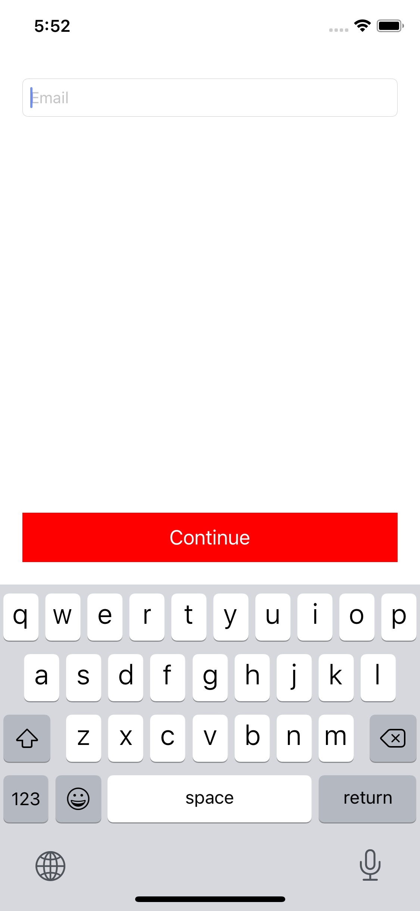

# RKControllerAccessoryView

<p align="center">

</p>

Add custom view above iOS keyboard


```swift
import RKControllerAccessoryView

contentView = UIView()
bottomMarginSpace = 20 // (default is 20)
```
